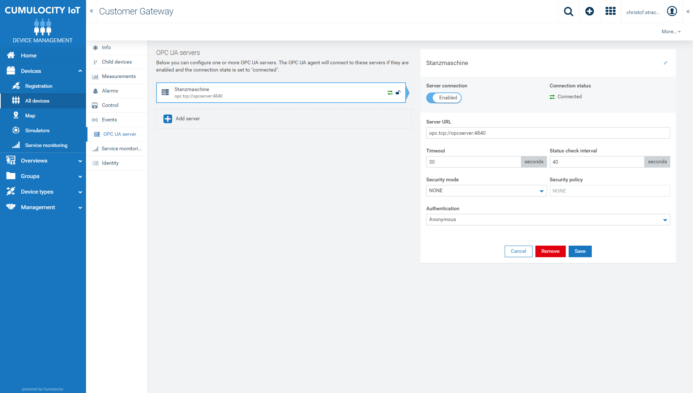
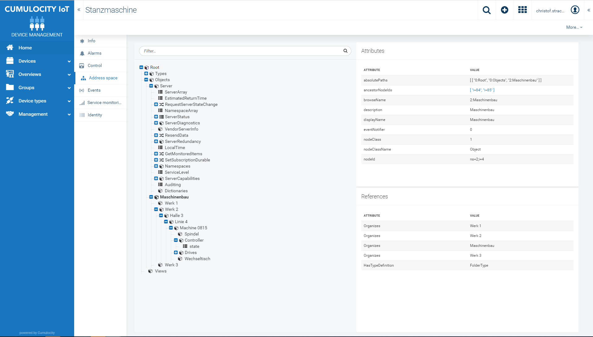

# OPC Server and Gateway

This solution creates a sample OPCServer including the required gateway to connect the OPC server to Cumulocity.
See as well: [OPC UA Agent Cumulocity](https://cumulocity.com/guides/10.7.0-beta/protocol-integration/opcua)
The registration data are stored in the ./data directory that are mapped as a volume to the docker service gateway. And thus still exits after a restart.

Update the gateway version to the most recent, this can be found [here](http://resources.cumulocity.com/examples/opc-ua/)

# Edit docker-compose.yaml and adapt the OPC_UA_GATEWAY_VERSION, baseUrl,identifier and the tenantId:
    version: "3.9"
    services:
    opcserver:
        build:
        context: ./opcserver
        ports:
        - "4840:4840"
    gateway:
        build:
        context: ./gateway
        args:
            OPC_UA_GATEWAY_VERSION: 1011.0.22
        environment:
        - baseURL=https://TENANT_URL
        - tenantId=TENANT_ID
        - gatewayIdentifier=GATEWAY_IDENTIFIER_LINE1
        - gatewayName=Line1 Gateway
        volumes:
        - ./data/:/data

The start the solution by running:

    docker-compose up -d --no-deps --build

# Register opcserver

Enter url opc.tcp://opcserver:4840 to connect the opc simulation server with Cumulocity gateway.

# Browse OPC tree

Once the gateway scanned the OPCTree you can view its content:

_____________________
This widget is provided as-is and without warranty or support. They do not constitute part of the Software AG product suite. Users are free to use, fork and modify them, subject to the license agreement. While Software AG welcomes contributions, we cannot guarantee to include every contribution in the master pro
